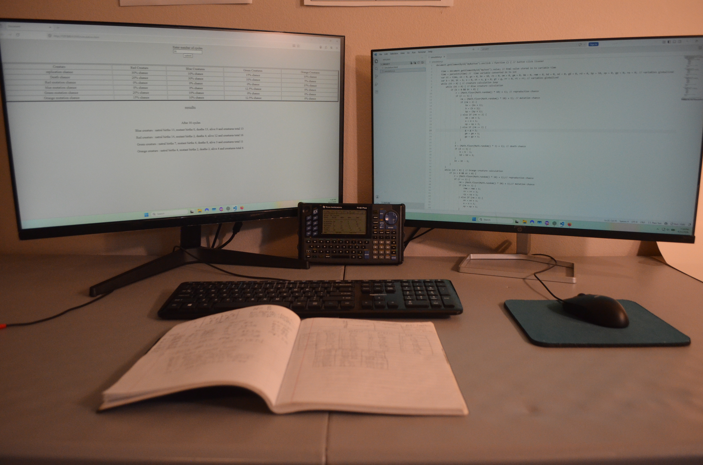
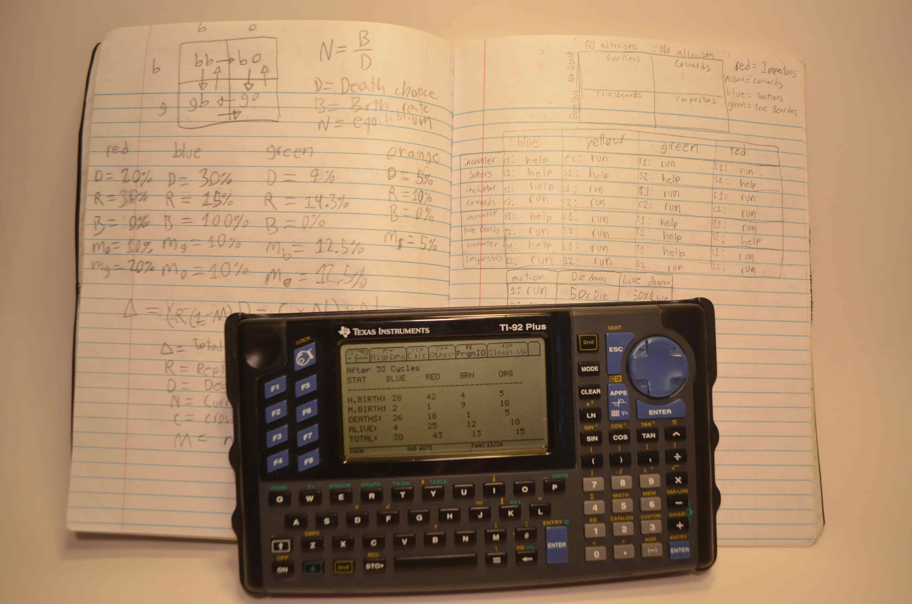
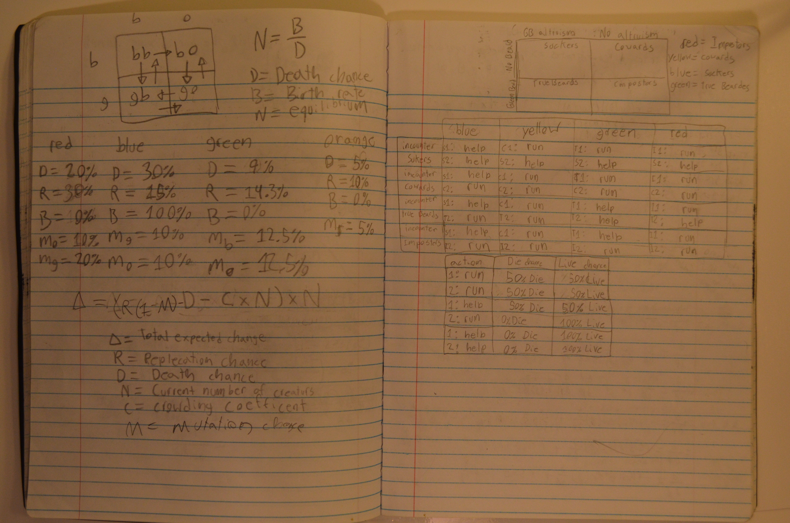
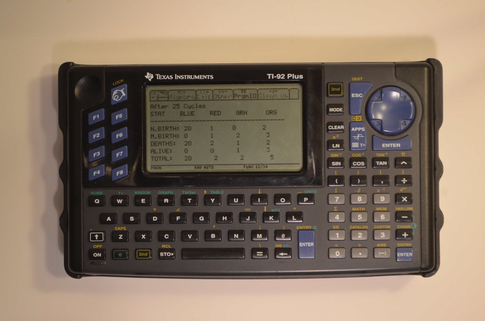
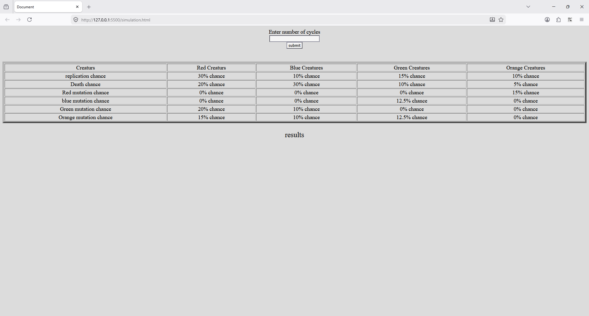
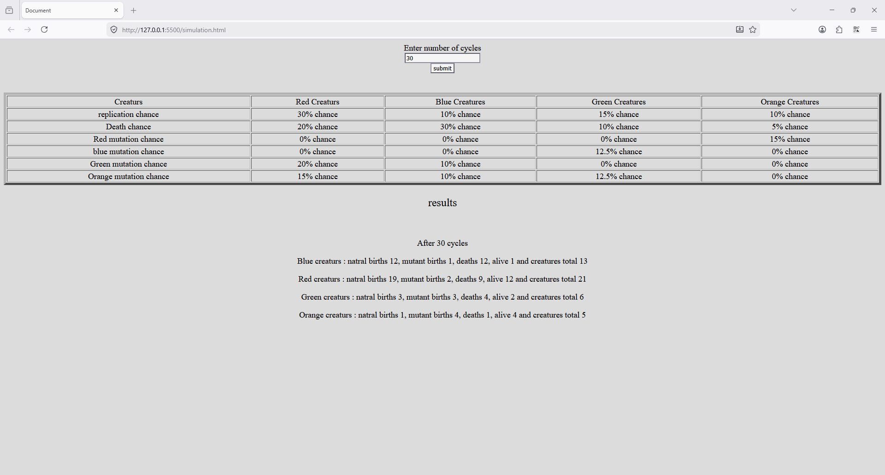
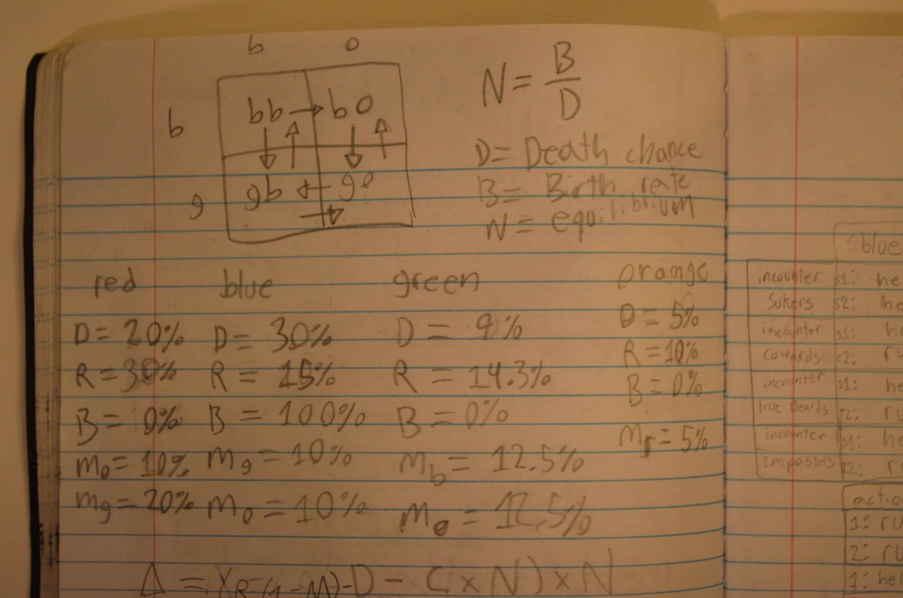
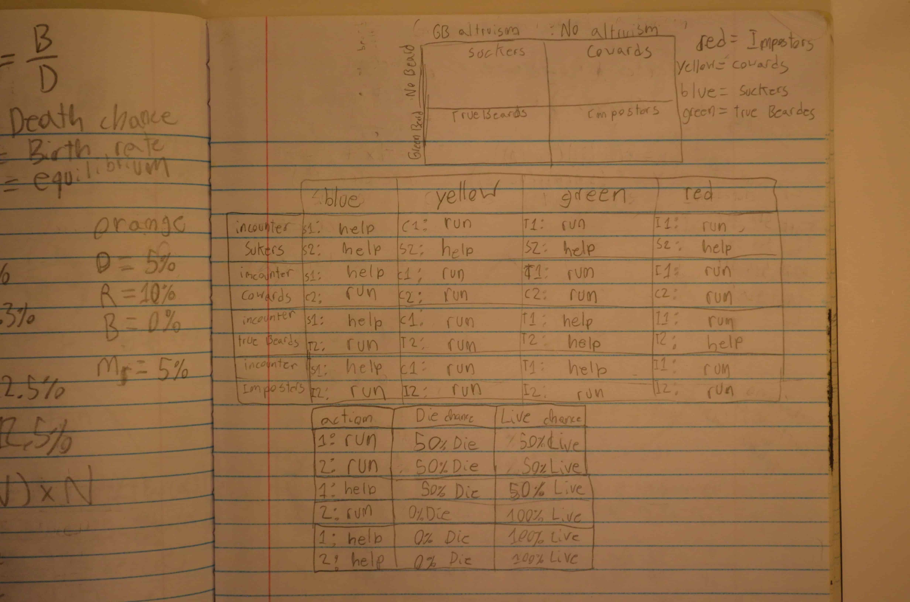
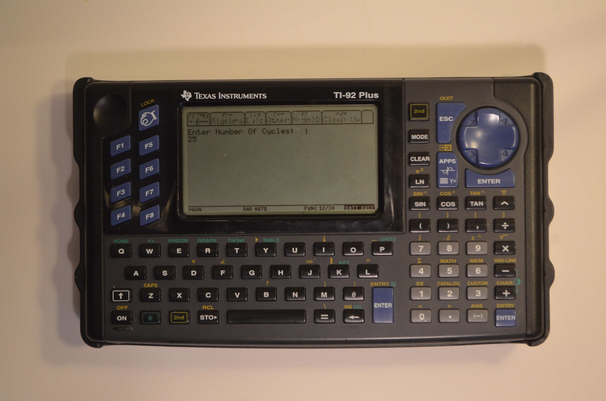

# Competition and Logistic Growth Simulation

*Original TI-92 Plus simulation developed in 2022 and later adapted into JavaScript.*

 

## Overview

This repository preserves the complete historical record of one of my earliest programming projects.

The simulation models four species interacting through probabilistic reproduction, mutation, and death events. Although simple by modern standards, it represents my first attempt to model a complex system through code and serves as the starting point of a progression that later led to embedded systems, wireless telemetry, and amateur radio engineering projects.

 

## Historical Context

In 2022, after becoming interested in evolutionary simulations and population modeling, I began experimenting with ways to represent these ideas on a TI-92 Plus graphing calculator.

The original project was inspired by simulation videos exploring mutation, competition, and population dynamics. Working within the limitations of a graphing calculator forced me to think carefully about variables, probability, state tracking, and system behavior.

Several years later, surviving notebook notes, JavaScript adaptations, and calculator code were used to reconstruct and document the original project.

 
 

## Project Evolution

### Phase 1 — Notebook Design

Simulation probabilities, mutation pathways, and species interactions were first designed on paper.

 

### Phase 2 — TI-92 Plus Implementation

The simulation was implemented on a TI-92 Plus graphing calculator.

Features included:

* Four interacting species
* Probabilistic reproduction
* Species mutation pathways
* Species-specific mortality rates
* Population tracking across simulation cycles
* Statistical reporting of births, deaths, and survivors

 

### Phase 3 — JavaScript Adaptation

The simulation was later rewritten in JavaScript and HTML while preserving the original logic.

#### Before Execution

#### After Execution

 
 

## Timeline

| Year | Event                               |
| ---- | ----------------------------------- |
| 2022 | Original notebook notes created     |
| 2022 | TI-92 Plus simulation developed     |
| 2022 | JavaScript adaptation created       |
| 2026 | Historical reconstruction completed |
| 2026 | Repository documentation completed  |

 
 

## Notebook Notes

### Simulation Parameters

The notebook contains the original reproduction, mutation, and mortality probabilities used to construct the simulation.

### Development Notes

These notes document ideas related to population dynamics and simulation behavior that influenced later versions of the project.

 

## TI-92 Reconstruction

The original calculator implementation was successfully reconstructed and verified.

### Program Execution

### Simulation Results

 
 

## Releases

### Original TI-92 Plus Source Code

A walkthrough of the reconstructed TI-92 Plus source code.

**Release:** [Original TI-92 Plus Source Code](https://github.com/JamesValencia45/competition-and-logistic-growth-simulation/releases/tag/v1.0-ti92-source-code)

 

### Original TI-92 Plus Simulation Demonstration

A demonstration of the original simulation running on TI-92 Plus hardware.

**Release:** [Original TI-92 Plus Simulation Demonstration](https://github.com/JamesValencia45/competition-and-logistic-growth-simulation/releases/tag/v1.0-ti92-simulation-demo)

 
 

## Significance

Although technically simple, this project introduced several concepts that would continue to appear throughout later projects:

* Probability
* Simulation
* State tracking
* Systems thinking
* Engineering iteration

The progression from notebook notes, to calculator implementation, to JavaScript adaptation reflects the beginning of a longer interest in mathematics, programming, engineering, and computational modeling.

 

## Related Projects

* [Wireless Attitude Telemetry](https://github.com/JamesValencia45/wireless-attitude-telemetry)
* [Weather Balloon Telemetry (in development)](https://github.com/GBHS-Amateur-Radio/weather-balloon-telemetry)

 

*Part of the Competition and Logistic Growth Simulation historical archive.*
